# 基于Springboot的购物推荐网站 

## Springboot-0062


## 技术栈

Springboot mybatisplus vue mysql maven


## 数据库表(13张)


## 功能介绍

```properties
管理员功能有，个人中心，用户管理，商品类型管理，商品信息管理，商品销售排行榜管理，系统管理，订单管理。

用户功能有，个人中心，查看商品，查看购物资讯，购买商品，查看订单，我的收藏，商品评论。
```


## 图片

### 前台


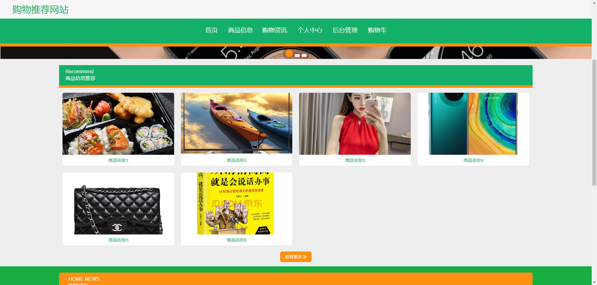

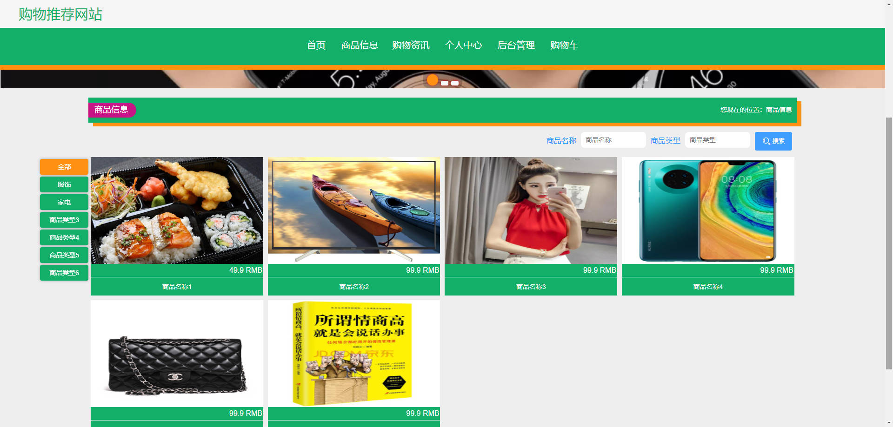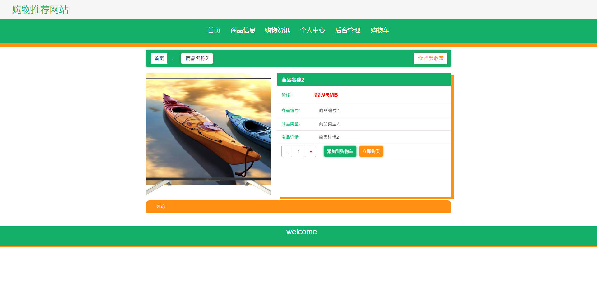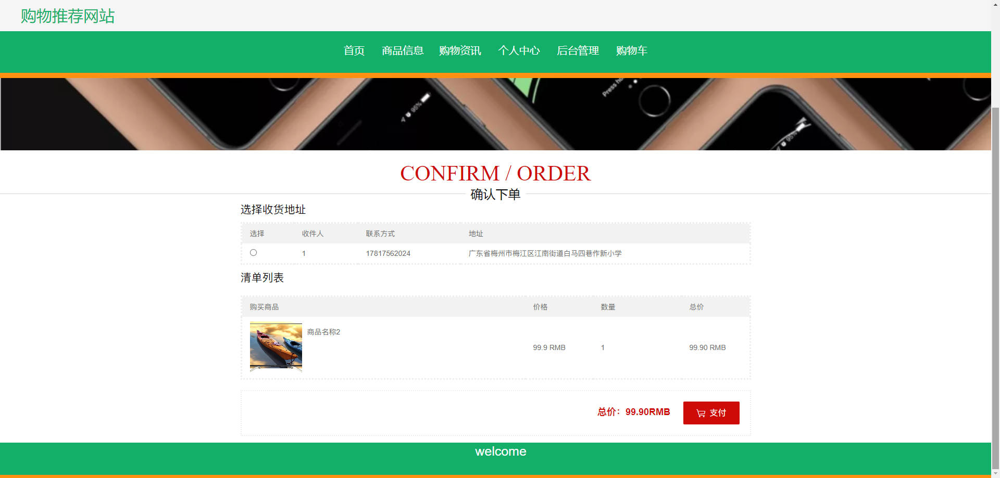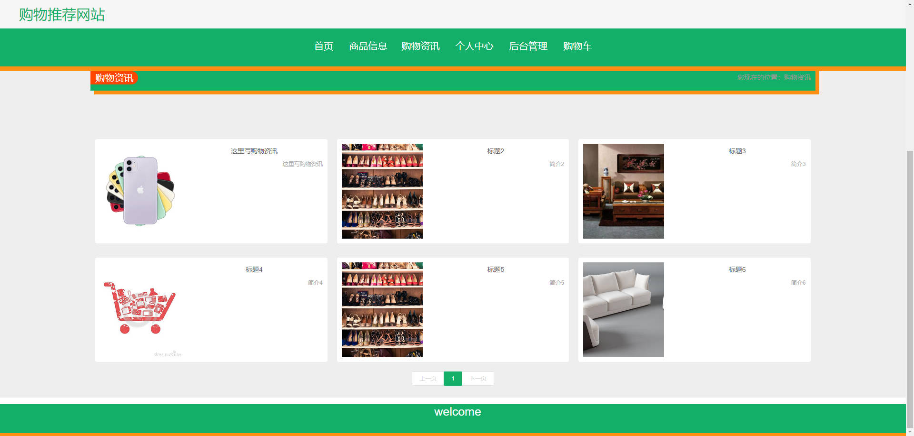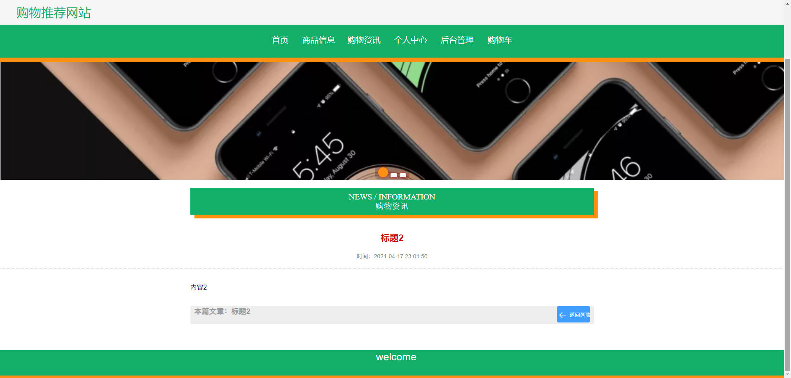

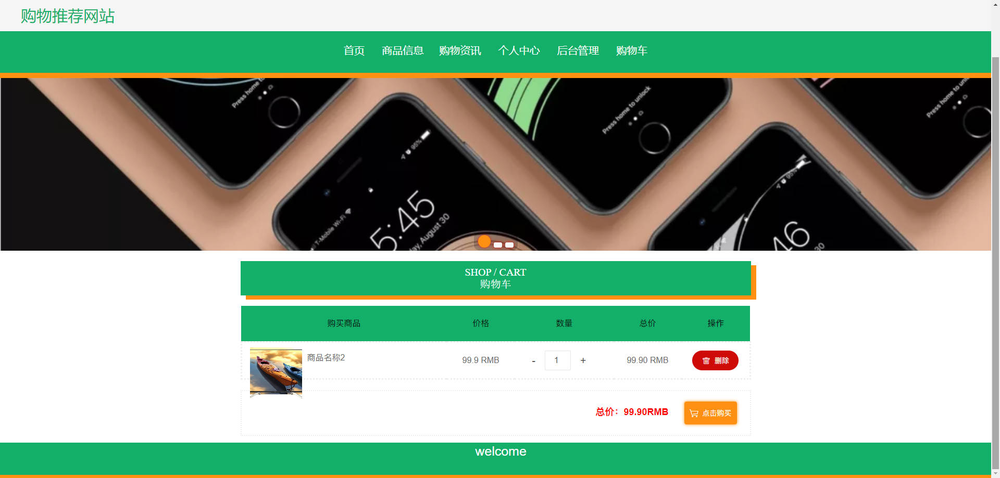

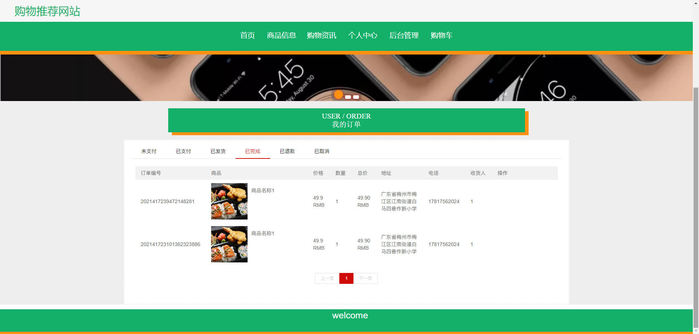

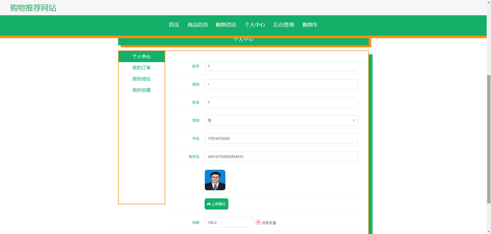

### 后台


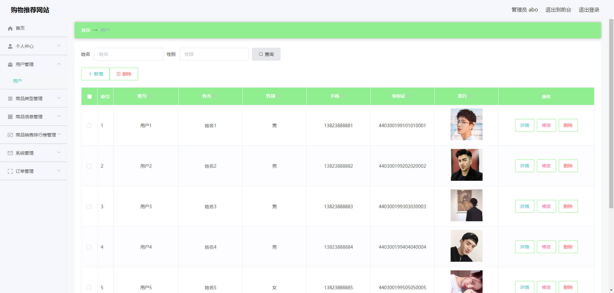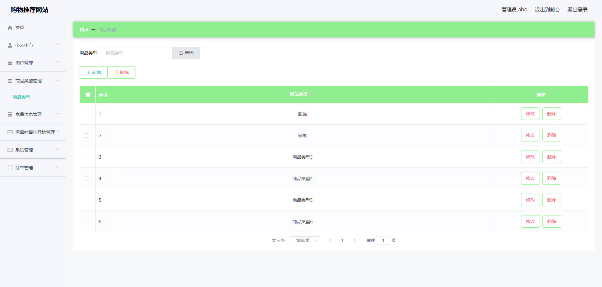

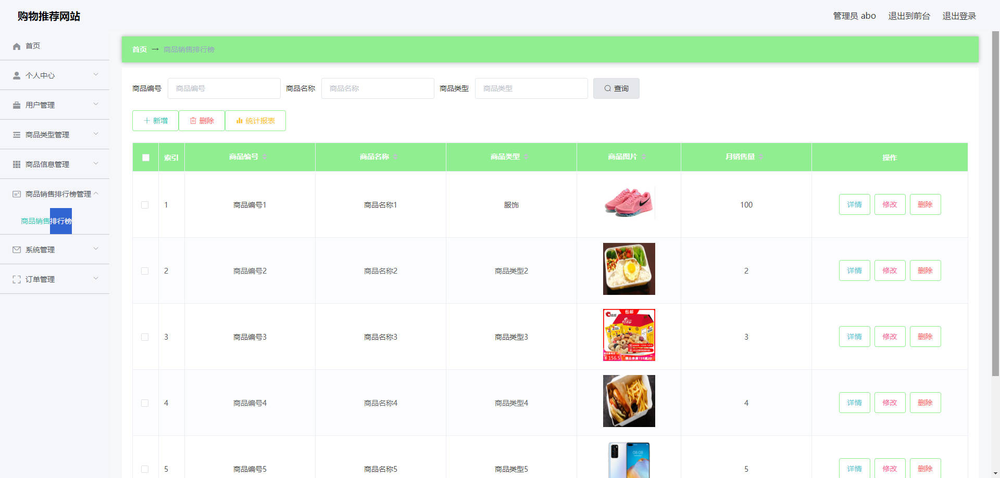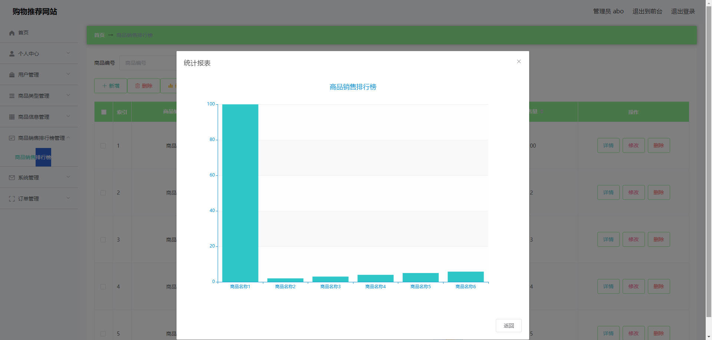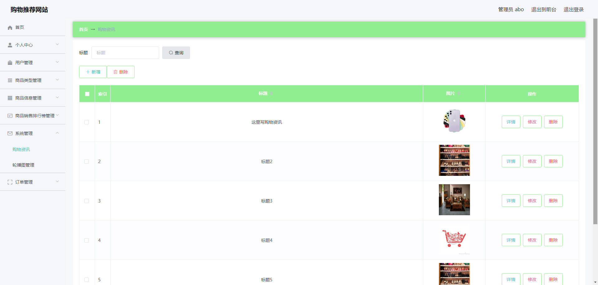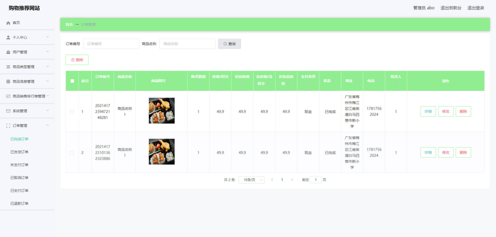


## 访问路径

### 前台

```properties
http://localhost:8080/springboot707pd/front/pages/login/login.html

账号 1
密码 1
```

### 后台

```properties
http://localhost:8080/springboot707pd/admin/dist/index.html#/login

账号 abo
密码 abo
```


## 功能图

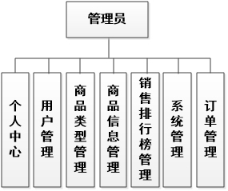

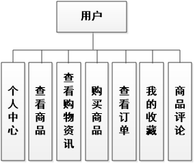

## 文档目录

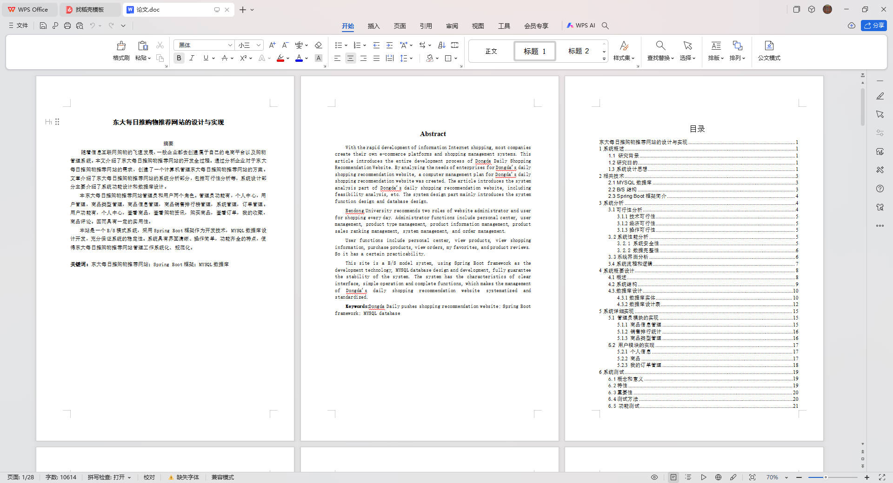


## 打赏或交流


